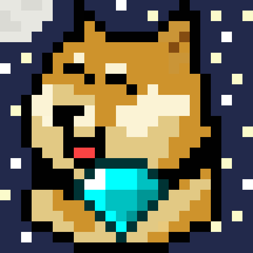
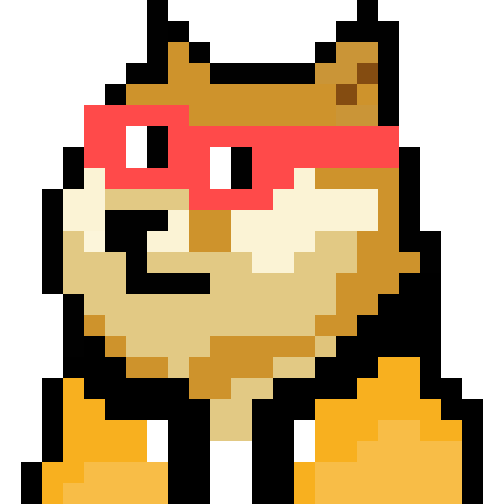
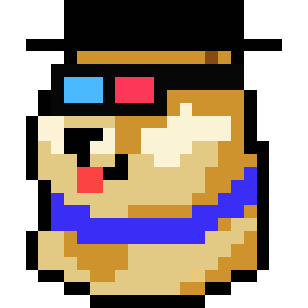
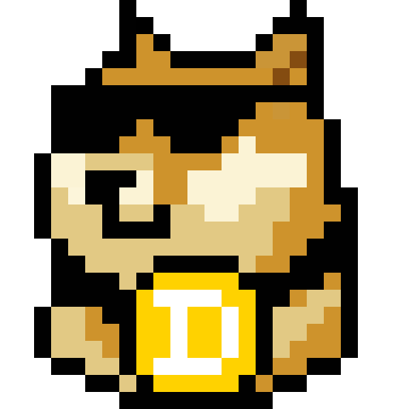
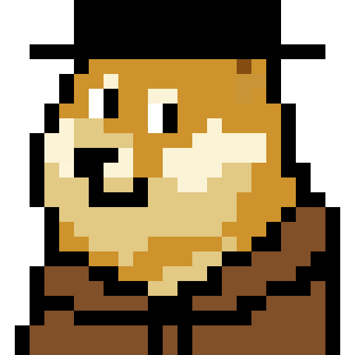
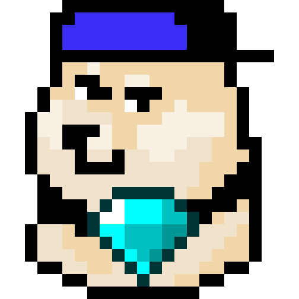
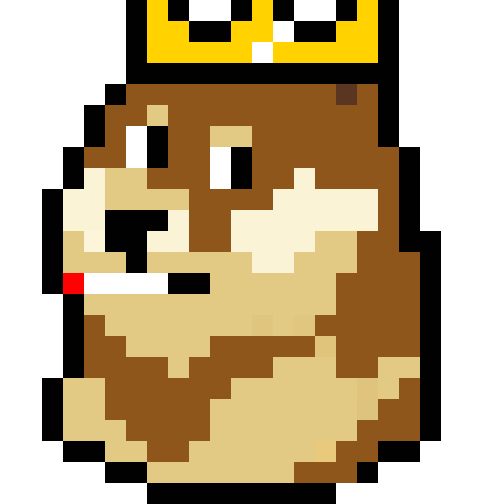
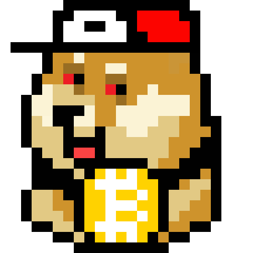

# 🎮 Memory Game - Mini Doges Collection

<div align="center">
  
  
  
  
</div>

## 📖 Description

Un jeu de mémoire (Memory) unique mettant en vedette la collection Mini Doges, la première collection historique de 10 000 NFTs sur la blockchain Dogecoin. Testez votre mémoire en associant les paires de Mini Doges tout en découvrant cette collection emblématique !

### 🎯 Aperçu des Mini Doges

<div align="center">
  
  
  
  
  
</div>

## ⚙️ Prérequis

- Python 3.x
- PIL (Python Imaging Library)
- Tkinter (inclus avec Python)

## 🚀 Installation

1. Clonez le repository :
```bash
git clone [votre-repo-url]
cd memory-game
```

2. Installez les dépendances :
```bash
pip install -r requirements.txt
```

## 🎮 Utilisation

Pour lancer le jeu :
```bash
python memory_game.py
```

## 📁 Structure du projet

```
memory_game/
│
├── memory_game.py      # Code principal du jeu
├── card_back.png      # Image du dos des cartes
├── *.png              # Images des Mini Doges
├── requirements.txt   # Dépendances Python
└── README.md         # Documentation
```

## 🎲 Comment jouer

1. Lancez le jeu en exécutant `memory_game.py`
2. Cliquez sur deux cartes pour les retourner
3. Si les images correspondent, elles restent visibles
4. Si les images ne correspondent pas, elles se retournent après un court délai
5. Le jeu est terminé lorsque toutes les paires sont trouvées

## 🛡️ Fonctionnalités de sécurité

- ✅ Validation des images (format, taille, intégrité)
- 📊 Gestion de la mémoire avec limite de 100MB
- 🔒 Gestion des erreurs robuste
- 💬 Messages d'erreur explicites pour l'utilisateur

## 🎨 Collection Mini Doges

La collection Mini Doges représente un moment historique dans l'écosystème Dogecoin, étant la première collection de 10 000 NFTs sur cette blockchain. Chaque Mini Doge est unique et fait partie de cette collection emblématique.